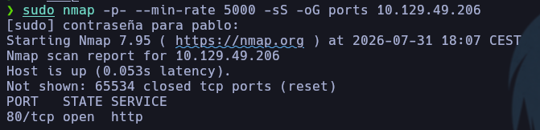
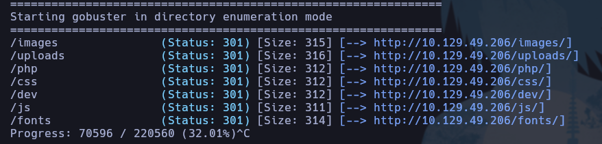
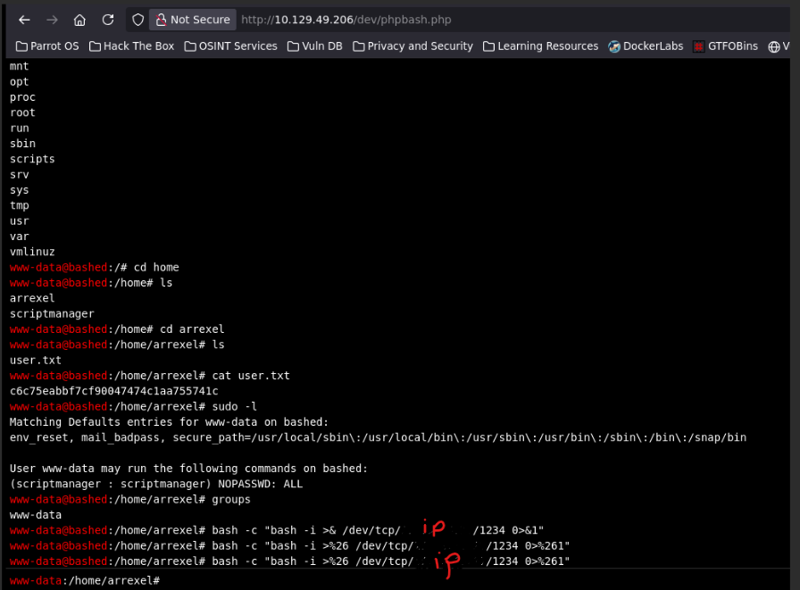
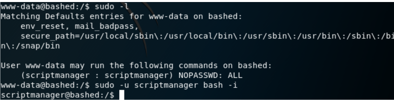
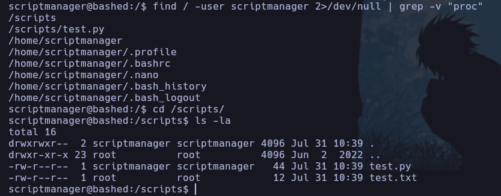
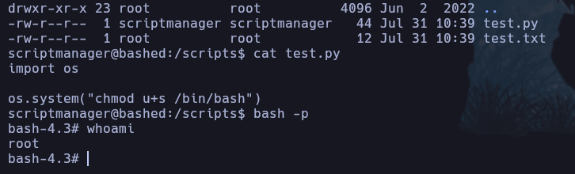

## Bashed

## Índice

- [Enumeration](#enumeration)
- [Gaining Access](#gaining-access)
- [Privilege Escalation](#privilege-escalation)
- [Conclusion](#conclusion)

## Enumeration

Al enumerar puertos abiertos solo encontramos el puerto 80.

## Gaining Access

Para ver por donde podía ganar acceso, use gobuster para ver si encontraba más direcciones. 

 `gobuster dir -u http://10.129.49.206/ -w /usr/share/SecLists/Discovery/Web-Content/DirBuster-2007_directory-list-2.3-medium.txt`

/dev contenía lo que buscabamos. Un archivo .php que al abrirlo nos devolvía una bash en el propio navegador. Simplemente apliqué reverse shell para pasarmela a mi máquina y poder trabajar más cómodo.

## Privilege Escalation

Para convertirnos en el usuario scriptmanager, apliqué el comando sudo -u scriptmanager /bin/bash ya que www-data podía correr cualquier comando siendo scriptmanager. 

Para convertirme en root si que me costó un poco más. Tuvé que ir buscando por los directorios en busca de alguna pista. Finalmente, lo que me sirvió en lugar de ir buscando uno a uno, fué lo siguiente: 

`find / -user scriptmanager 2>/dev/null | grep -v "proc" `

Esto lo que hace es buscar archivos cuyo propietario sea scriptmanager y eliminar cualquier línea que contenga la palabra proc ( no nos interesa en este filtrado )

Como se puede observar, scripts contiene un par de archivos interesantes. Me metí al directorio y como pude observar, test.py se puede modificar y al ejecutarlo lee el archivo .txt ( que es leído por root). Por tanto, modificando el archivo .py conseguí elevar privilegios para convertirme en root.

## Conclusion

Máquina bastante sencilla.