## BRAINFUCK


## Índice

- [Enumeración](#enumeración)
- [Acceso inicial](#acceso-inicial)
- [Escalada de privilegios](#escalada-de-privilegios)
- [Conclusión](#conclusión)


## Enumeración

Realizamos un escaneo con Nmap.

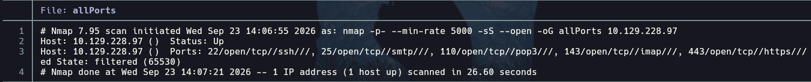

Información sobre los puertos abiertos:

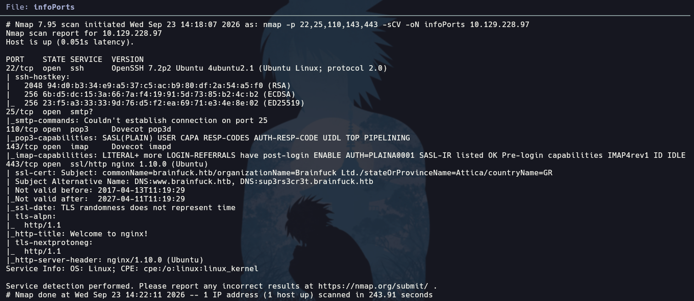

Tenemos lo siguiente:

- Dos dominios en el puerto 443 que añadiremos a nuestro `/etc/hosts`.

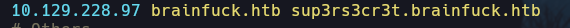

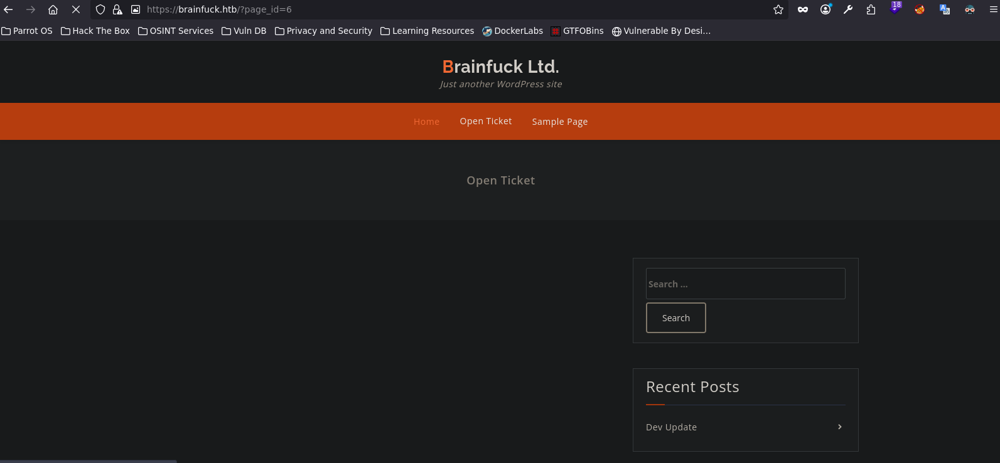

Nos encontramos ante un WordPress. Por tanto, lo primero que se me ha ocurrido es analizarlo con la herramienta WPScan:

```bash
wpscan --url https://brainfuck.htb --disable-tls-checks --enumerate p,u
```

Usamos `--disable-tls-checks` porque la página está protegida por un certificado.

Obtenemos un plugin interesante y un par de usuarios:

 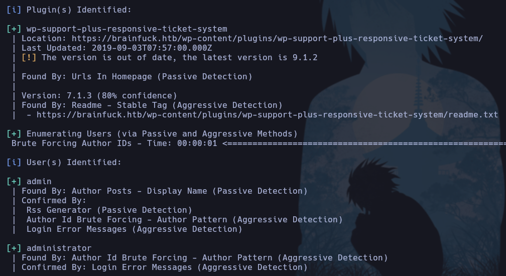

Encontramos un exploit interesante con SearchSploit para el plugin:

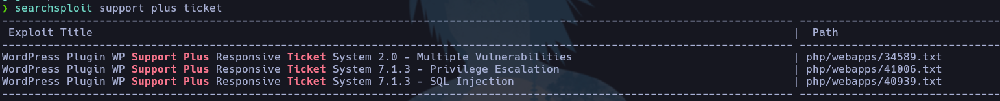

Vamos a utilizar el segundo: 

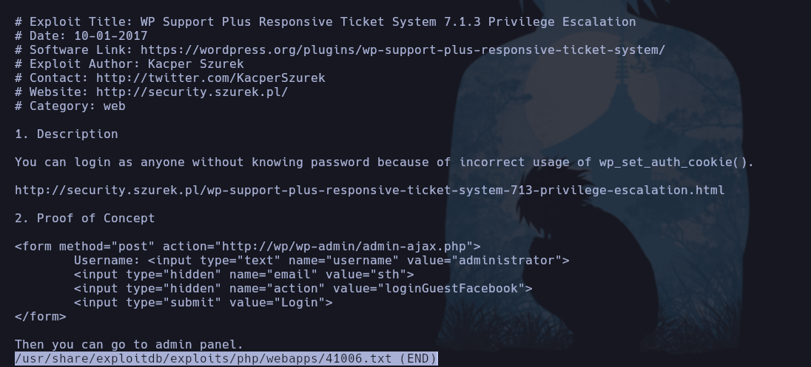

Le cambiamos la ruta y, al ser un archivo `.html`, montamos un servidor con PHP o Python para conectarnos desde Internet usando `localhost`:

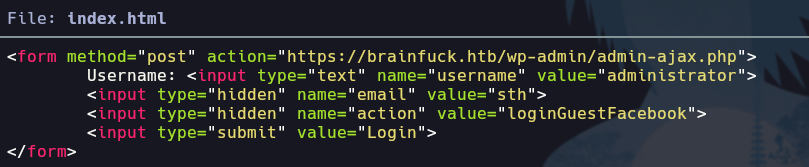

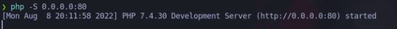

Nos aparecerá lo siguiente:

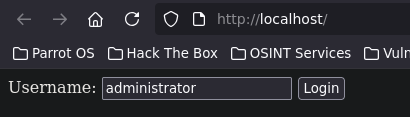

Le damos a Login y conseguimos acceso sin contraseña al WordPress como administrador.


## Acceso inicial

Suelo seguir los mismos pasos cuando estoy dentro de WordPress:

- Primero miro los plugins y las apariencias para ver si me deja editar algo. En Apariencia, el archivo que normalmente modificamos es `404.php`, pero en este caso no está.

- Al mirar los plugins, en uno de ellos, Easy WP SMTP, encontramos una contraseña. Aunque no se vea, al cambiar el atributo `type` de `password` podemos verla.

 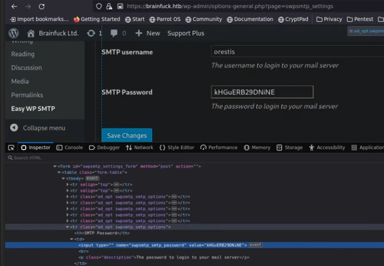

Por tanto, tenemos una contraseña que nos servirá para conectarnos como el usuario `orestis` al servicio POP3 del puerto 110.

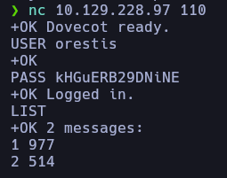

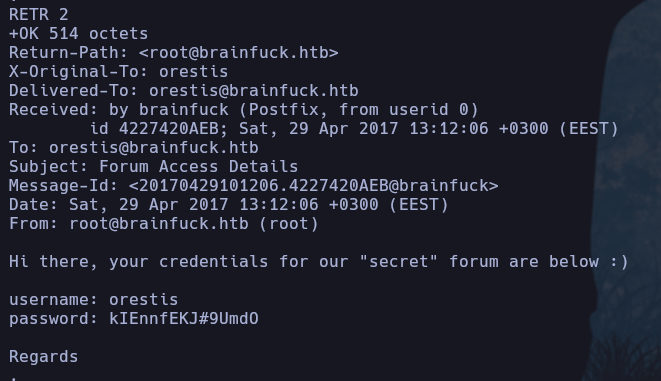

En el segundo mensaje obtenemos una contraseña para autenticarnos en el foro secreto.

Ahora empieza lo nuevo para mí: **Crypto Challenge - Vigenère Cipher**.

Esto ha sido completamente nuevo para mí y he tenido que buscar bastante información. Tenemos dos foros:

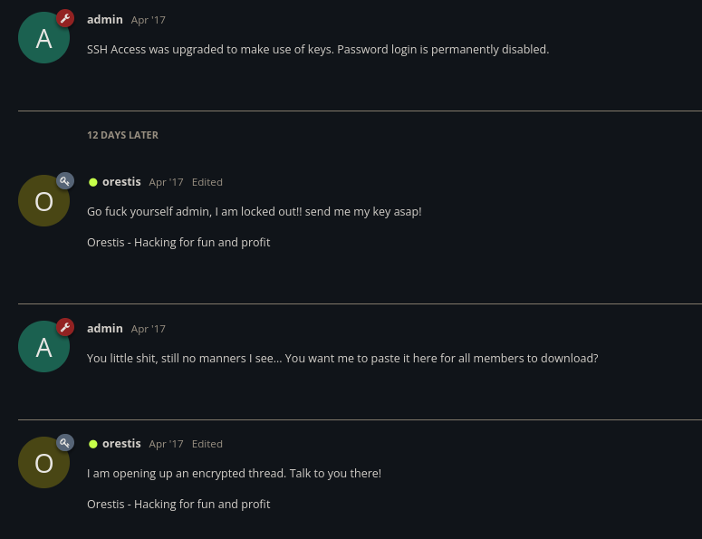


Podemos ver que en el foro Orestis deja siempre una firma:

Orestis - Hacking for fun and profit

En el foro cifrado observamos lo siguiente: se conserva la estructura de la frase, pero las letras cambian. Eso encaja con un cifrado de sustitución y, además, aparecen patrones que no mantienen siempre la misma sustitución. Por lo que he visto, encaja bastante con Vigenère.

He utilizado dCode para descifrar el mensaje. No tenemos la clave, pero podemos obtenerla gracias a la firma que Orestis repite:

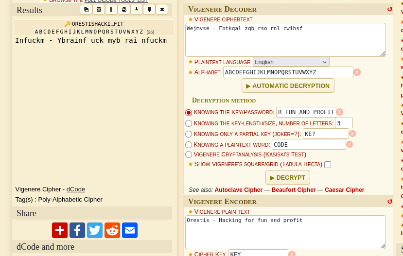

Como podemos observar, si conocemos el mensaje claro y el mensaje cifrado, al usar el mensaje claro para obtener la clave conseguimos un resultado interesante:

Infuckm - Ybrainf uck myb rai nfuckm

fuckmybrain puede ser la clave. 

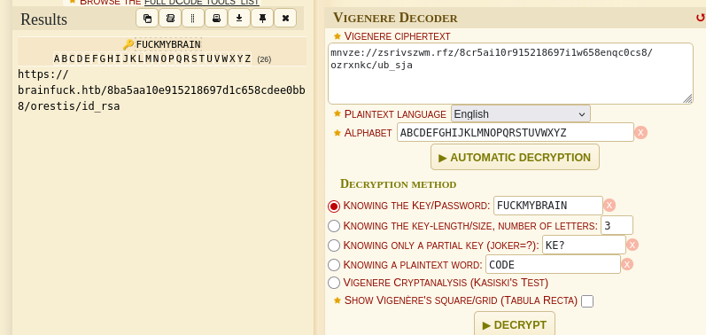

Y efectivamente obtenemos el archivo `id_rsa` para descargarlo. Lo siguiente que tenemos que hacer es conseguir la passphrase que nos pide al intentar conectarnos por SSH como `orestis`.

Simplemente transformamos `id_rsa` a hash con `ssh2john` y aplicamos fuerza bruta con John y el diccionario `rockyou`. Obtenemos la contraseña y conseguimos acceso.


## Escalada de privilegios

Obtenemos la user flag nada más obtener acceso.

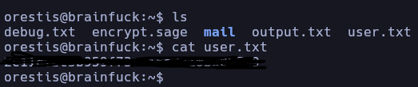

Para convertirnos en root hay dos formas en este caso:

1. Como pertenecemos al grupo `lxd`, podemos explotarlo. Existe un exploit que crea un contenedor y permite acceder desde él a la máquina víctima. Encontramos el exploit ejecutando `SearchSploit lxd` y seguimos los pasos indicados:

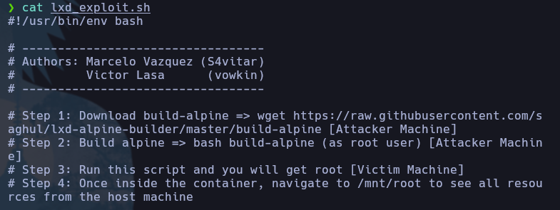

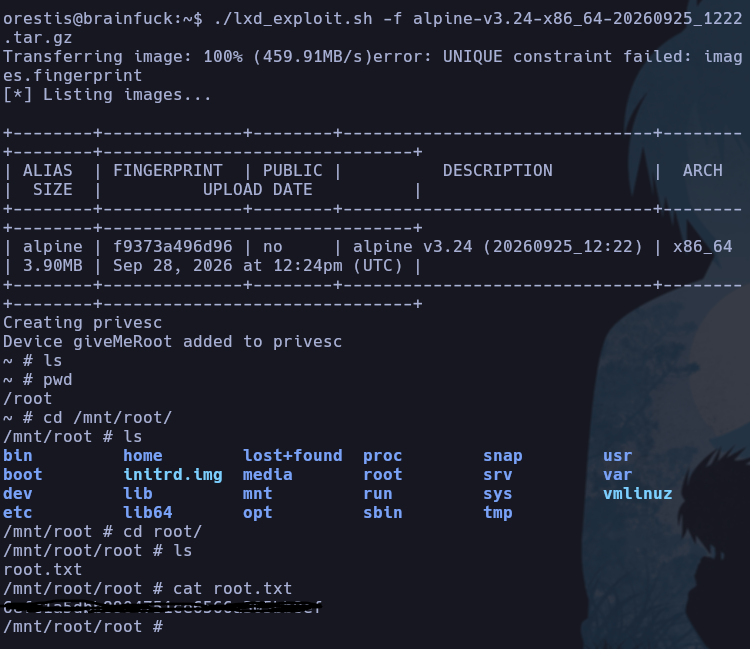

Transferimos el archivo `.tar.gz` y el script `.sh` a la máquina víctima y los ejecutamos como se muestra en la imagen. Esto crea automáticamente un contenedor con la información de la máquina víctima en el directorio `/mnt/root`. Así obtenemos la flag de root.

2. Esta segunda opción sería la vía prevista para la máquina.

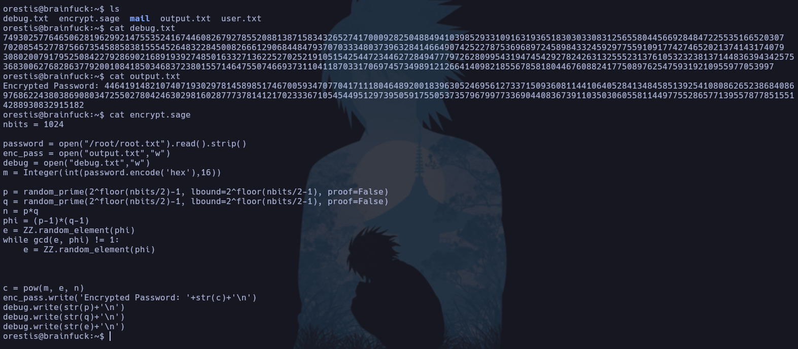

Esta vez vemos varios archivos. En uno de ellos tenemos una contraseña cifrada. En el archivo `encrypt.sage` podemos ver que se escriben `p`, `q` y `e`. Sabemos que son esos valores porque también aparecen en `debug.txt`. Se trata de criptografía RSA. Lo he resuelto de la siguiente forma:

- Primero he calculado en una página `n = p x q`:
https://www.tausquared.net/pages/ctf/rsa.html

- A continuación, en dCode introduzco todos los valores y finalmente lo descifro:
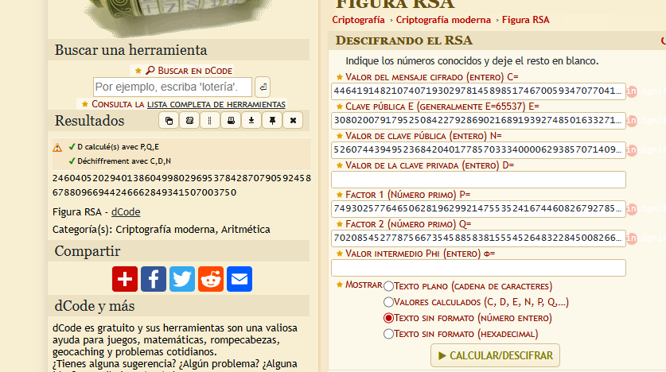

Nos da un valor numérico que parece ser la flag, pero está representado en decimal. Por tanto, tenemos que pasarlo a hexadecimal y posteriormente descifrarlo con dCode:

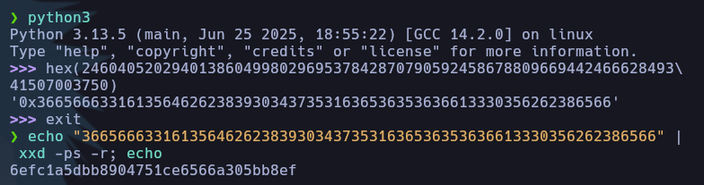

## Conclusión

TLS Certificate Inspection
WordPress Enumeration
WordPress WP Support Plus Responsive Ticket System Exploitation - Gaining access as admin user
Information Leakage - Data type conversion for displaying a password in cleartext
POP3 Enumeration
Crypto Challenge - Vigenère Cipher
Gaining access over SSH
Abusing LXD group [Privilege Escalation] (1st way) [Unintended]
RSA Crypto Challenge (2nd way) [Privilege Escalation]