## Jeeves

## Índice

- [Enumeración](#enumeración)
- [Acceso inicial](#acceso-inicial)
- [Escalada de privilegios](#escalada-de-privilegios)
- [Conclusión](#conclusión)

## Enumeración

Puertos encontrados:
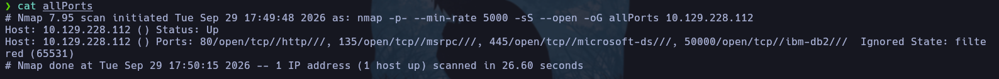

Analizando el puerto 80, no hemos sacado nada.
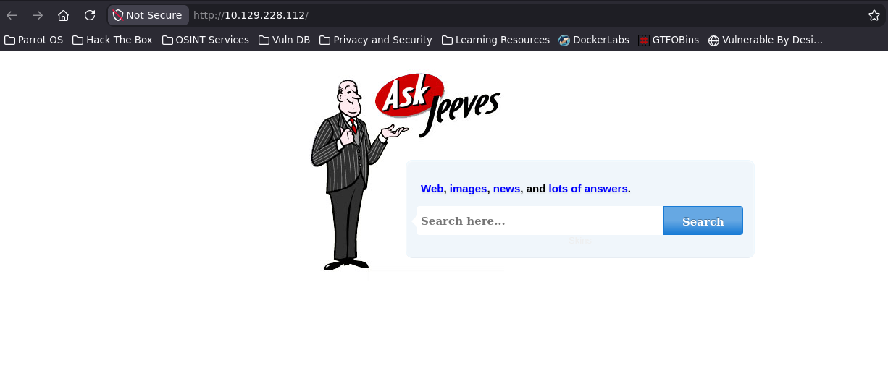

Realizando fuzzing al puerto 50000 encontramos lo siguiente: 

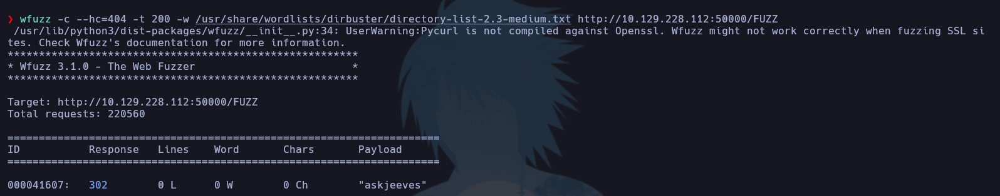

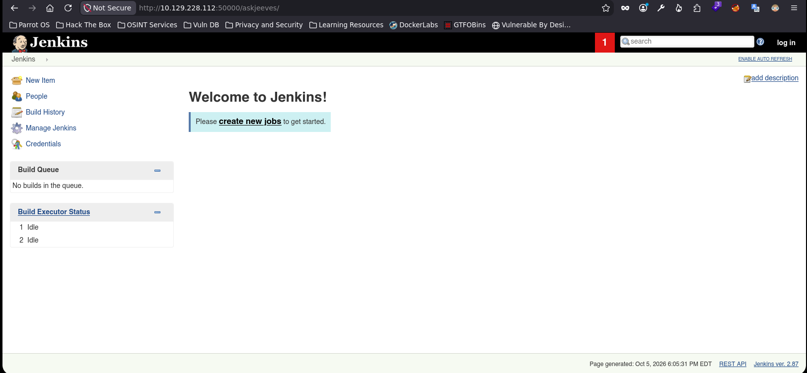

Si seleccionamos `Manage Jenkins`, hay una opción que permite ejecutar comandos: `Script Console`.
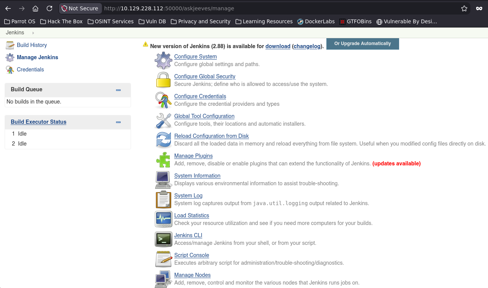

Desde aquí vamos a conseguir acceso a la shell. 


## Acceso inicial

Para acceder a la shell, tendremos que ponernos en escucha desde nuestra máquina atacante y, a continuacion, ejecutar el siguiente código que hemos encontrado en github sobre reverse shell en jenkins. Se trata de Groovy script:

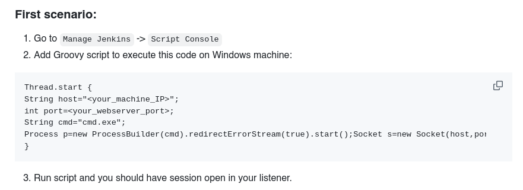

Una vez dentro, buscamos la primera flag, `user.txt`. Sabemos que hay un usuario llamado `kohsuke`, por tanto, vamos a buscar su directorio.
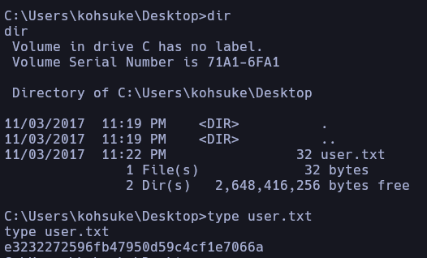


## Escalada de privilegios

Para la escalada de privilegios, encontramos en el directorio `Documents` de `kohsuke` un archivo llamado `CEH.kdbx`.

CEH.kdbx es muy probablemente una base de datos de contraseñas de KeePass.

.kdbx → formato de base de datos de KeePass.
CEH → probablemente el nombre que le pusieron a la base de datos.
Puede contener usuarios, contraseñas, URLs, notas, etc., protegidos mediante cifrado.

Por tanto, lo transferimos a nuestra máquina atacante y lo abrimos con KeePassXC:

```bash
keepassxc CEH.kdbx
```

Nos pide una contraseña, por lo que tenemos que crackear el archivo para obtenerla. Lo hacemos de la siguiente forma:
- Con keepass2john convertimos el archivo en un hash, y con john lo crackeamos

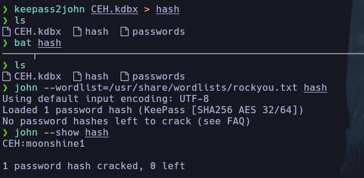

Una vez conseguida la contraseña, accedemos a la base de datos de KeePass y obtenemos un hash interesante en `Backup stuff`.
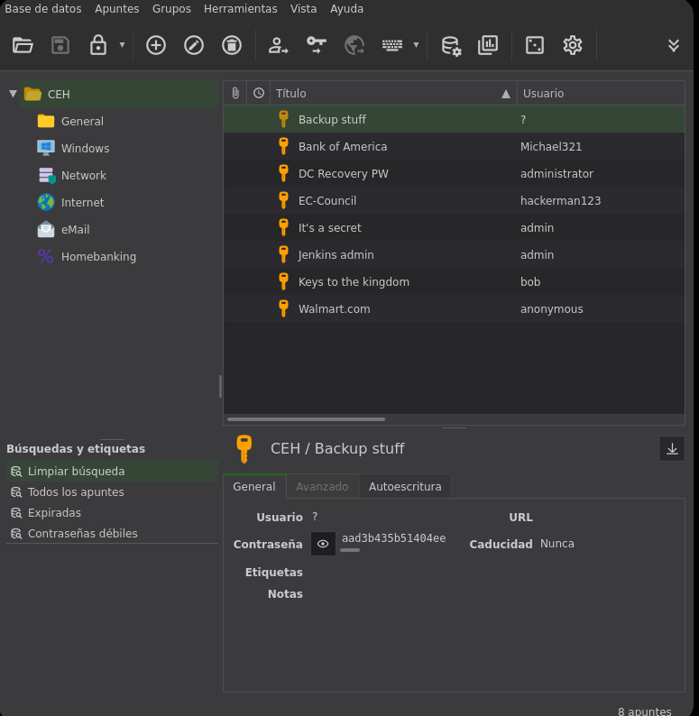
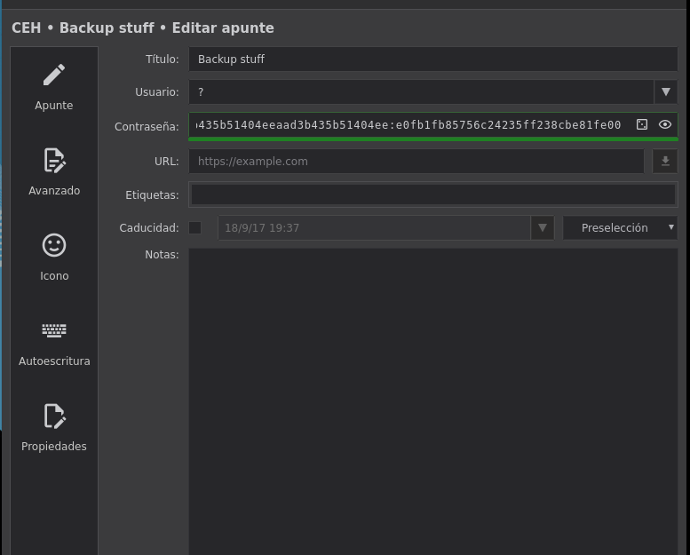

Con NetExec podemos proporcionar un hash para comprobar si conseguimos acceso a los recursos compartidos como `Administrator`:

En NetExec, -H significa que vas a proporcionar un hash NTLM en lugar de una contraseña.

```bash
nxc smb <IP> -u Administrator -H <NTLM_HASH> --shares
```

Es decir:

- `-u`: usuario.
- `-p`: contraseña.
- `-H`: hash NTLM.
- `--shares`: enumera los recursos SMB.
Esto se conoce como Pass-the-Hash (PtH): autenticarte usando el hash sin necesitar conocer la contraseña original.

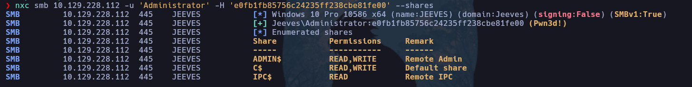

Como tenemos acceso, podemos probar a obtener una shell de Windows con privilegios usando `impacket-psexec`:

`impacket-psexec` sirve para ejecutar comandos remotamente en una máquina Windows mediante SMB, normalmente aprovechando credenciales válidas o un hash NTLM.

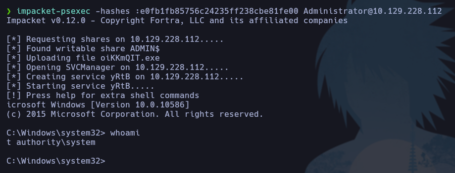

Para encontrar la root_flag, nos movemos hasta el directorio de Administrador y vemos que nos dice que busquemos más a fondo. 

En CMD de Windows:

```cmd
dir /r
```

muestra los archivos y, además, sus Alternate Data Streams (ADS).

Podemos ver que hay un ADS y leerlo usando el comando `more`.

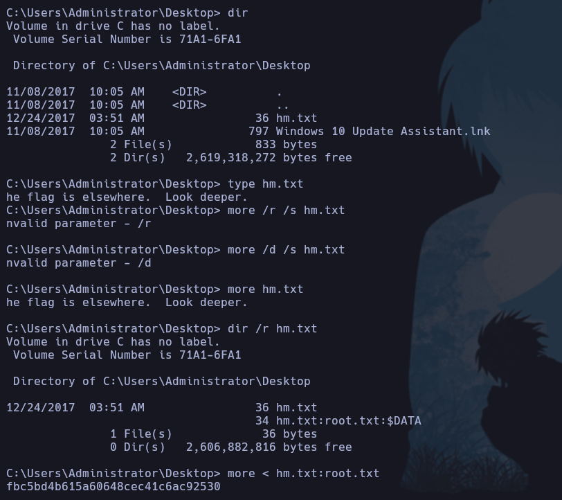

## Conclusión

Skills: 

Jenkins Exploitation (Groovy Script Console)

PassTheHash (Psexec) 

Breaking KeePass Alternate Data Streams (ADS)
