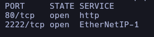
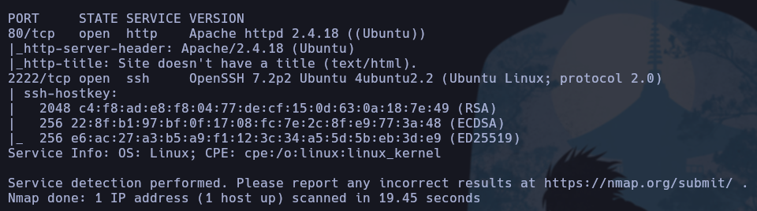
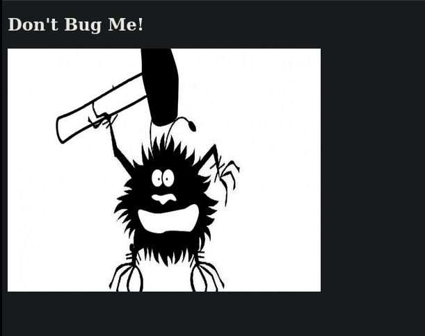
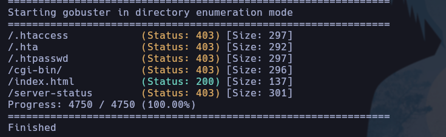
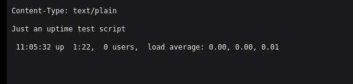
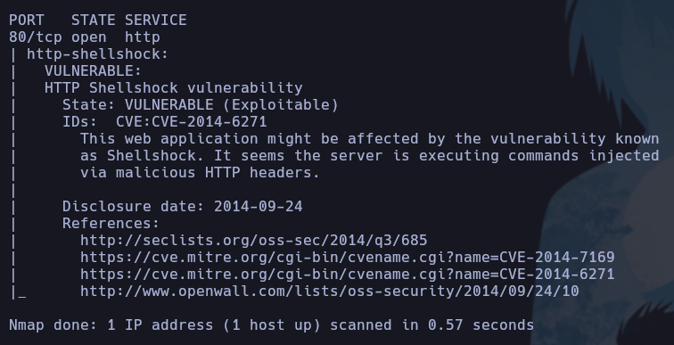
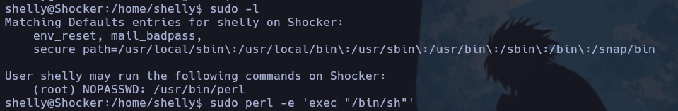
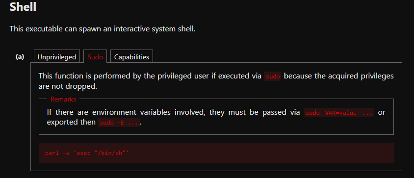

## SHOCKER

## Índice

- [Enumeración](#enumeración)
- [Acceso inicial](#acceso-inicial)
- [Escalada de privilegios](#escalada-de-privilegios)
- [Conclusión](#conclusión)

## Enumeración

Lo primero que hice fue hacer un ping a la máquina para comprobar si estaba activa.

``ping -c 1 <ip>``

La respuesta mostraba un TTL de 63, lo que indicaba que se trataba de una máquina Linux.

Una vez verificado que estaba activa, lancé un escaneo completo con Nmap para identificar los puertos abiertos.

``sudo nmap -p- --min-rate 5000 -sS -oG ports <ip>``

Me gusta guardar el resultado en formato `-oG` por si más adelante necesito revisar de nuevo qué puertos estaban abiertos.

Para obtener más información sobre los servicios, lancé otro escaneo con detección de versiones y scripts por defecto.

``nmap -sCV -p80,2222 10.129.48.127``

Al entrar en la página web, nos encontramos con lo siguiente:

Después de esto, usé Gobuster para buscar directorios y archivos ocultos, y obtuve el directorio `cgi-bin`.

Volví a ejecutar Gobuster sobre `cgi-bin` para enumerar su contenido. Como parte de la investigación, busqué información sobre este directorio y comprobé que en este tipo de entornos suele ser útil probar extensiones como `.sh`.

Cuando vemos CGI o algo similar, debemos pensar en un posible ataque de **Shellshock**. Esta vulnerabilidad afecta al intérprete de comandos Bash y permite ejecución remota de código arbitrario mediante la manipulación de variables de entorno.

Para comprobar si el servicio era vulnerable, utilicé el script correspondiente de Nmap. Es importante indicar la ruta completa al script CGI, ya que si no, no lo detecta correctamente.

``nmap --script http-shellshock --script-args uri=/cgi-bin/user.sh -p80 10.129.48.127``

Podemos ver que es vulnerable. A continuación vamos a ver como ejecutar un shellshock.

## Gaining Access

Como shellshock es vulnerable, vamos a conseguir ganar a acceso a través de él. 

Explorando por internet, encontramos la forma en la que los atacantes usan shellshock para ganar acceso. Dejo el link que me ha servido a mi:

https://borjaab.github.io/Cursos-CyberSec-H4U/Introducci%C3%B3n-al-Hacking-%F0%9F%92%BB/OWASP-TOP-10-y-vulnerabilidades-web/Ataque-ShellShock

Conseguimos el acceso a la shell y como siempre, lo primero que hago es tratar la tty para poder movernos cómodos. 

Ahora sí, obtenemos la primera flag ( user.txt ) ya que somos Shelly y no www-data. Ahora quedaría escalar privilegios.

## Privilege Escalation

Para escalar privilegios podemos ver que comandos puede usar Shelly como root usando el comando ``sudo -l`` 

Vemos que podemos usar perl como root, por tanto, si nos metemos en gtfobins para ver cual es el comando para elevar privilegios con perl podemos ver lo siguiente: 

Conseguimos elevar privilegios y ser root y por ende, conseguimos la siguiente flag.

## Conclusion

Ha sido la primera vez que exploto una máquina con SHELLSHOCK. Me ha parecido interesante y he aprendido varios conceptos. 